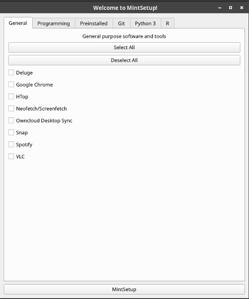
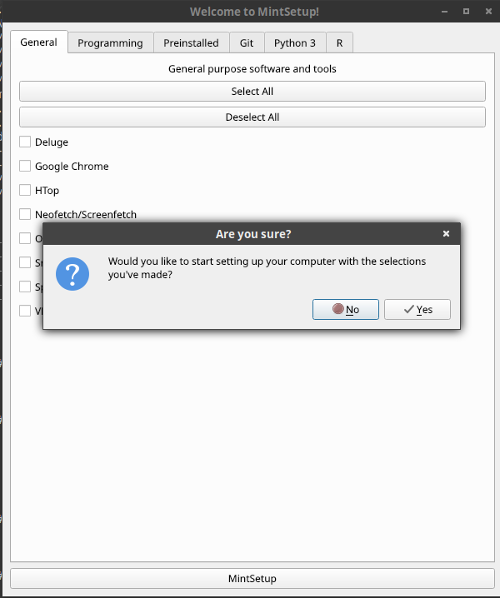
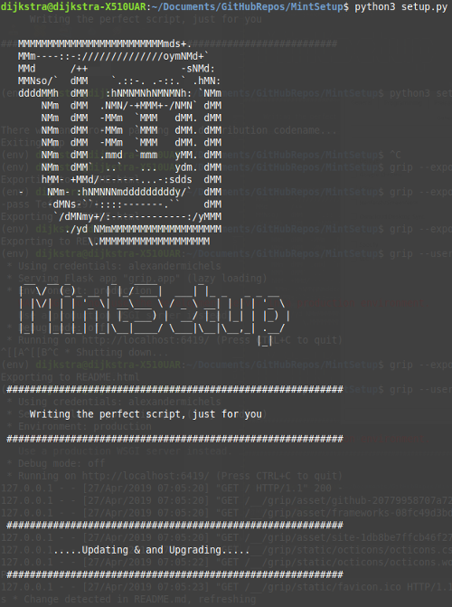

# Mint Setup 2.0.0

```

MMMMMMMMMMMMMMMMMMMMMMMMMmds+.        
MMm----::-://////////////oymNMd+`     
MMd      /++                -sNMd:    
MMNso/`  dMM    `.::-. .-::.` .hMN:   
ddddMMh  dMM   :hNMNMNhNMNMNh: `NMm  
    NMm  dMM  .NMN/-+MMM+-/NMN` dMM            __  __ _       _   ____       _
    NMm  dMM  -MMm  `MMM   dMM. dMM           |  \/  (_)_ __ | |_/ ___|  ___| |_ _   _ _ __
    NMm  dMM  -MMm  `MMM   dMM. dMM           | |\/| | | '_ \| __\___ \ / _ \ __| | | | '_ \
    NMm  dMM  -MMm  `MMM   dMM. dMM           | |  | | | | | | |_ ___) |  __/ |_| |_| | |_) |   
    NMm  dMM  .mmd  `mmm   yMM. dMM           |_|  |_|_|_| |_|\__|____/ \___|\__|\__,_| .__/   
    NMm  dMM`  ..`   ...   ydm. dMM                                                   |_|    
    hMM- +MMd/-------...-:sdds  dMM   
    -NMm- :hNMNNNmdddddddddy/`  dMM   
     -dMNs-``-::::-------.``    dMM   
      `/dMNmy+/:-------------:/yMMM   
         ./ydNMMMMMMMMMMMMMMMMMMMMM
            \.MMMMMMMMMMMMMMMMMMM
```


***

## Table of Contents
* <a href="#intro">Introduction</a>
* <a href="#usage">Usage</a>
* <a href="#faq">Frequently Asked Questions (FAQ)</a>
* <a href="#bin">/bin Contents</a>
* <a href="#version">Versioning</a>
* <a href="#todo">TODO</a>

## <a id="intro">Introduction</a>

This is Python App to build a Bash script that will help you configure your [Linux Mint](https://www.linuxmint.com/) computers with all of the applications you want in a single script. This is meant to be as general as possible (using your distro codename), but when I need to make a decision, I make it to work for the most recent version of Linux Mint Cinnamon, right now that is [Linux Mint 19 "Tara" Cinnamon](https://www.linuxmint.com/edition.php?id=254). The app gives you a wide variety of packages to choose from, pre-installed software to remove, and cleans up your setup in a quick and easy GUI.

***

## <a id="usage">Usage</a>

Running the app is super simple, and you have three choices.

* **Bash Script to Execute Everything for You:** Open a terminal in the directory where `setup.py` is and run the following command. This option tries to download Python 3 and all requirements first, and deletes the virtualenv it runs in. Optionally, you can also use the `-d` or `--delete` flags to have the script delete the entire directory when its done.

```bash
bash run.sh
```
```bash
bash run.sh -d
```
```bash
bash run.sh --delete
```

* **Make the Python Script Executable:** Open a terminal in the directory where `setup.py` is and run the following command (to make it executable), then double click `setup.py` and hit "Run".

```bash
chmod +x setup.py
```

* **Run the Script in the Command Line:** Open a terminal in the directory where `setup.py` is and run the following command

```bash
python3 setup.py
```

When you run the app, you'll see this screen:



You can navigate through the various tabs, checking boxes for things you'd like to install/uninstall. The "Git" page also has text boxes if you'd like to setup a git cache so you don't have to enter credentials as often.

Once you are ready, click the "MintSetup" button at the bottom. If you have any settings that are odd (like installing R packages without install R) a dialog will pop up. If everything is fine, you'll see the dialog below asking if you're ready to set up your computer:



Once you click yes, you're done! If you're running in the terminal, the script will notify you what is happening in real time:



***

## <a id="faq">Frequently Asked Questions (FAQ)</a>
* [How does it work?](#faq-howitworks)
* [Is anything installed that I can't disable?](#faq-required)
* [What is a distribution codename?](#faq-codename)
* [What software do I have the option to install?](#faq-options)
* [What software do I have the option to uninstall?](#faq-uninstall)

### <a id="faq-howitworks">How does it work?</a>

The `commands.json` file acts a huge dictionary that maps the appropriate software to the appropriate commands to install them. The Python3 app runs the GUI and records your choices, then uses this dictionary to compile all the necessary commands you need into a Bash script called `your_setup.sh` in the /bin folder. Feel free to check out your setup script there.

### <a id="faq-required">Is anything installed that I can't disable?</a>

The app does a dist-upgrade and downloads [cURL](https://curl.haxx.se/) by default. Here is a full list of everything else you can download:

### <a id="faq-codename">What is a distribution codename?</a>

It's kind of like a version for Ubuntu-based OSs. You can find yours by running the following command in the terminal:

```bash
alias upstream-lsb="grep DISTRIB_CODENAME /etc/upstream-release/lsb-release | grep -o --colour=never \"[a-z-]*$\""
```

### <a id="faq-options">What software do I have the option to install?</a>

* **General**
    * [Deluge](https://deluge-torrent.org/)
    * Docker
    * [Google Chrome](https://www.google.com/chrome/)
    * HTop
    * Laptop Mode Tools
    * [Neofetch/Screenfetch](https://github.com/KittyKatt/screenFetch)
    * Owncloud Desktop Sync
    * Snap
    * [Spotify](https://www.spotify.com/us/)
    * TLP
    * [VLC](https://www.videolan.org/vlc/index.html)
* **Programming**
    * [Atom](https://atom.io/)
    * [CMake](https://cmake.org/)
    * [G++](https://linux.die.net/man/1/g++)
    * [Gradle](https://gradle.org/)
    * [Grip](https://github.com/joeyespo/grip)
    * [Maven](https://maven.apache.org/)
    * [Mesa 3D Graphics Library (libosmesa6-dev and libgl1-mesa-dev)](https://mesa3d.org/)
    * [MiKTeK (as admin)](https://miktex.org/)
    * OpenJDK/JRE 8
    * [Open MPI (libopenmpi-dev)](https://www.open-mpi.org/)
    * [Oracle JDK 8](https://www.oracle.com/technetwork/java/index.html)
    * [PatchELF (utility to modify the dynamic linker and RPATH of ELF executables)](https://nixos.org/patchelf.html)
    * [OpenGL API (libgl1-mesa-dev)](https://www.mesa3d.org/)
    * [QGIS](https://qgis.org/en/site/index.html)
    * [TexStudio](https://www.texstudio.org/)
    * Visual Studio Code
* **Git**
    * [Git](https://git-scm.com/)
    * with option to configure a username/email cache
* **Python 3**
    * Pip
    * [Spyder 3](https://github.com/spyder-ide/spyder)
    * Python Packages (Pip)
        * numpy
        * pandas
        * setuptools
        * virtualenv
        * wheel
    * Python Packages (System)
        * build-essential
        * libffi-dev
        * libssl-de
        * libxslt1-dev
        * matplotlib
        * python3-pytest
        * python3-dev
        * python3-tk
        * zliblg-dev
* **R**
    * [R](https://www.r-project.org/)
    * [RStudio](https://www.rstudio.com/)
    * R Packages
        * ggformula
        * mosaic
        * rmarkdown
    * System Packages
        * ess (Emacs Speaks Statistics)
        * r-doc-html
        * r-doc-pdf
        * r-recommended

### <a id="faq-uninstall">What software do I have the option to uninstall?</a>

You also have the option to remove some of the pre-installed software:

* [Hexchat](https://hexchat.github.io/)
* [Mopidy](https://www.mopidy.com/)
* [Pidgin](https://pidgin.im/)
* [Rhythmbox](https://wiki.gnome.org/Apps/Rhythmbox)
* [Transmission](https://transmissionbt.com/)
* [Xplayer](https://github.com/linuxmint/xplayer)

***

## <a id="bin">/bin Contents</a>

#### GeneralizeRequirementDotTxt.py

Simple script to take a "requirements.txt" file and strip the specific versions from it. Below demonstrates what I mean by this with "example==9.3.4" being a typical entry in a "requirements.txt" file and "example" being the output from my script.

> example==9.3.4 ---> example

If you want to bring over the Python packages you have installed, run the following command:

```bash
$ pip freeze > requirements.txt
```

For Python 2.X you probably want to probably want to prepend the command with "python -m" and for Python 3.X you would probably want "python3 -m".

#### Setup.sh

An older iteration of MintSetup without the GUI and without as many choices:

```bash
$ bash setup.sh
```

For the full version, use the `-f` or `--full` flag:

```bash
$ bash setup.sh -f
$ bash setup.sh --full
```

**Included Software:**
* [Atom](https://atom.io/)
* [CMake](https://cmake.org/)
* [Curl](https://curl.haxx.se/)
* [Deluge](https://deluge-torrent.org/)
* [G++](https://linux.die.net/man/1/g++)
* [Git (and configures a global email and name)](https://git-scm.com/)
* [Google Chrome](https://www.google.com/chrome/)
* [Pip (for Python 2 and Python 3)](https://pypi.org/project/pip/)
* A variety of "essential" Python packages
* [Screenfetch](https://github.com/KittyKatt/screenFetch)
* [Spotify](https://www.spotify.com/us/)
* [VLC](https://www.videolan.org/vlc/index.html)

**Both versions remove:**
* [Hexchat](https://hexchat.github.io/)
* [Mopidy](https://www.mopidy.com/)
* [Pidgin](https://pidgin.im/)
* [Rhythmbox](https://wiki.gnome.org/Apps/Rhythmbox)
* [Transmission](https://transmissionbt.com/)
* [Xplayer](https://github.com/linuxmint/xplayer)

#### Full

The full version additionally installs the following:

**Included Packages:**
* [Gradle](https://gradle.org/)
* [Grip](https://github.com/joeyespo/grip)
* [Open MPI (libopenmpi-dev)](https://www.open-mpi.org/)
* [JDK (Oracle Java 8)](https://www.oracle.com/technetwork/java/index.html)
* [Maven](https://maven.apache.org/)
* [Mesa 3D Graphics Library (libosmesa6-dev)](https://mesa3d.org/)
* [MiKTeK (as admin)](https://miktex.org/)
* [PatchELF (utility to modify the dynamic linker and RPATH of ELF executables)](https://nixos.org/patchelf.html)
* [OpenGL API (libgl1-mesa-dev)](https://www.mesa3d.org/)
* [QGIS](https://qgis.org/en/site/index.html)
* [R (with some R packages and essentials)](https://www.r-project.org/)
* [RStudio](https://www.rstudio.com/)
* [Spyder (for Python 2 and Python 3)](https://github.com/spyder-ide/spyder)
* [TexStudio](https://www.texstudio.org/)

***

## <a id="version">Versioning</a>

* 1.0.x : (March 17th, 2018 - September 11th, 2018)    | Just one version to setup
* 1.1.x : (September 12th, 2018 - November 24th, 2018) | Full and Lite versions
* 1.2.x : (November 25th, 2018 - April 26th, 2019)     | Added weekly scheduled updates
* 2.0.x : (April 27th, 2019 - Present)                 | GUI added to customize installation

***

## <a id="todo">TODO</a>

* Add "on Hover" information about software in the GUI
* Add more options
